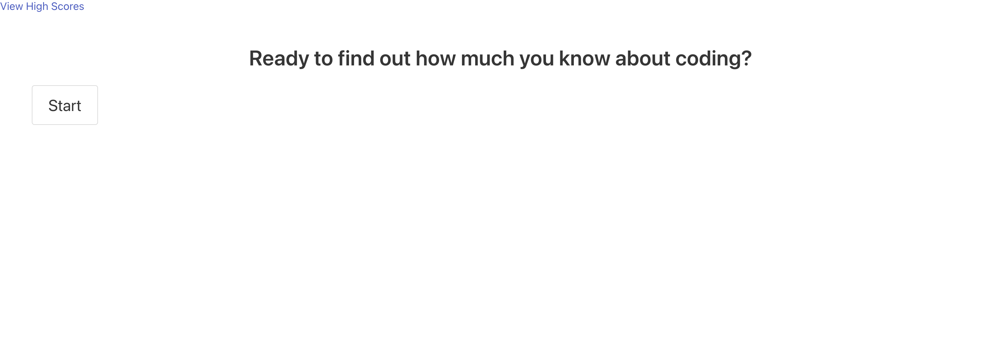
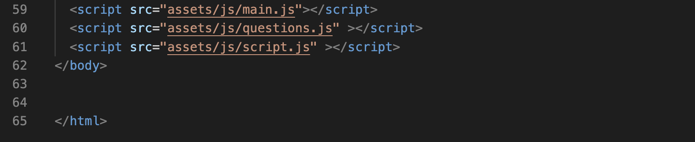
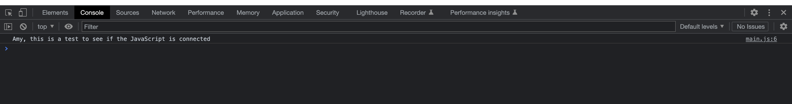
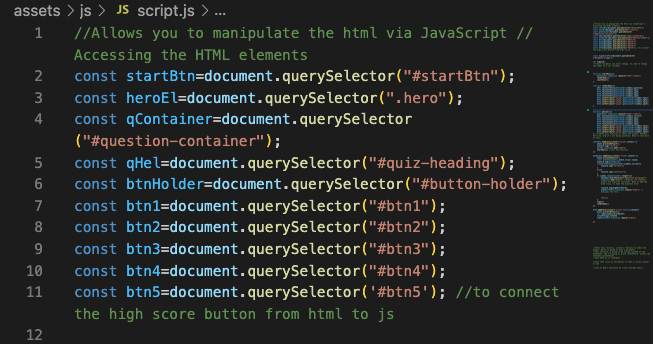
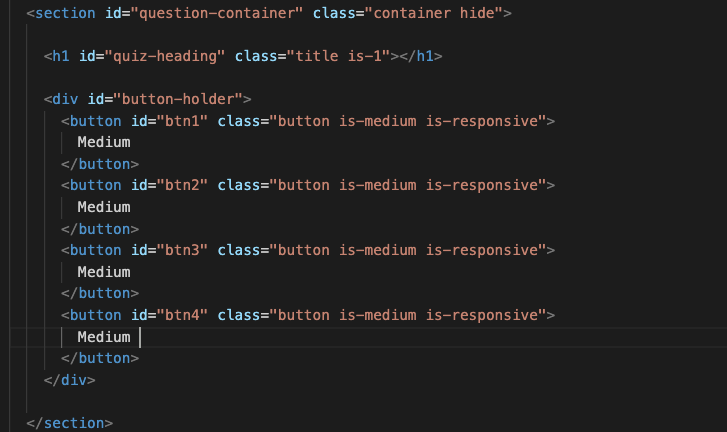
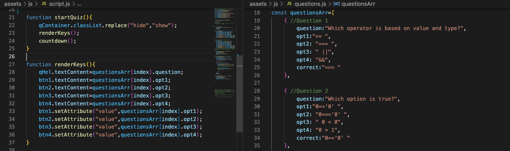
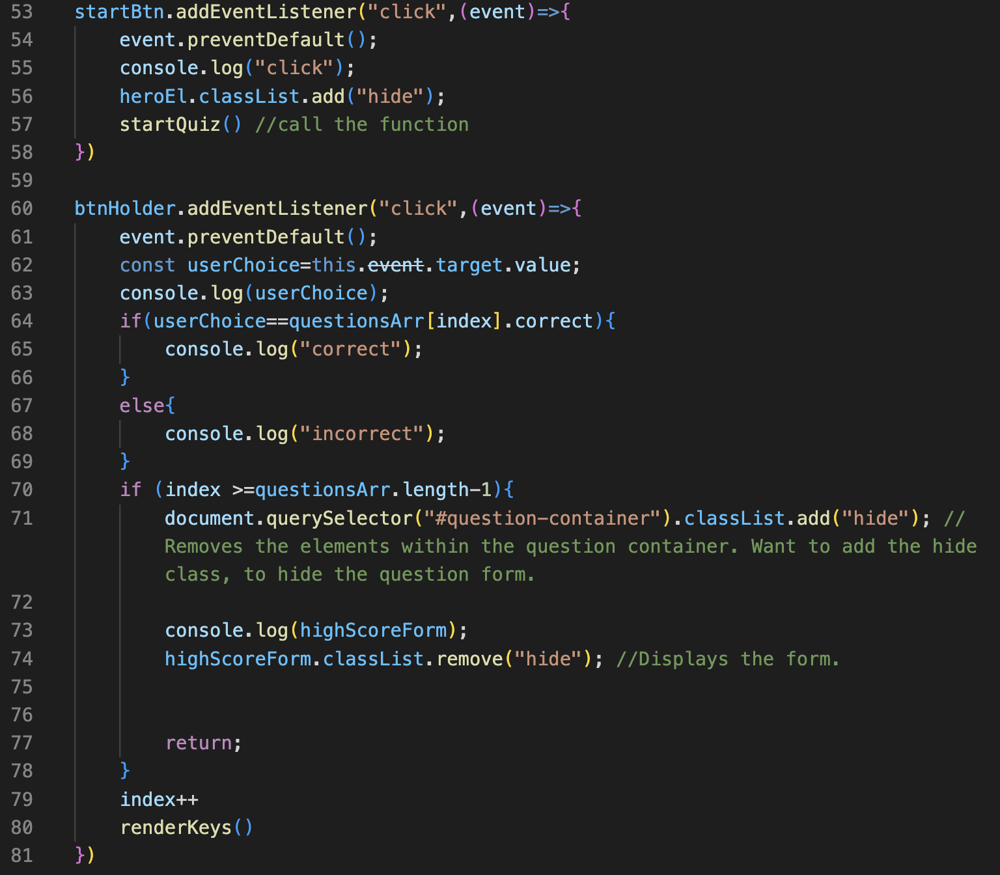

# Code Quiz

Welcome! Have you ever wondered how much (or little) you know about coding? To be honest, I didn't...that is up until a month ago. If you are a bit curious, then hopefully you'll find this coding quiz helpful! 

[Deployed Website](https://amylipscomb.github.io/code-quiz/)

<strong>My Task</strong>

Utilizing html, css and JavaScript, I had to build a coding quiz from scratch. The vision for the quiz is to have a timed quiz with multiple choice questions. In order to do this, the first thing I had to do was to make sure my JavaScript file was connected to the html file. To connect, I used the code below:

Notice how the coding is within the body section, within the html. I found out how important the placement of the code was when I console logged, and did not see my console.log within the console. I eventually came to the realization that it was because the main js was coded below the html. Once I fixed it, my message from my console log worked. See below! 

Once I finally had all of the js files connected to the html file, I then had to create variables within JavaScript and make sure that they were connected to the html file, by creating classes or ids within html. See the coding below for the JavaScript and notice how the classes/ids within the html match. 

After I had my variables set up, I was able to finally start creating arrays, functions, and event listeners. An array is a variable that stores a collection of multiple items. The items within an array can be comprised of several primitive data types (data types and definitions listed below):

- String
- Number
- Boolean
- Undefined
- Null  

In order to create an array, I learned the importance of the '[]' brackets. An array needs the square brackets. I used this to create my questions. See the code below. 

Within the screenshot above, you can also see one of the functions used, to start the quiz! As mentioned before, I also had to use event listeners. 

Above you can see the coding! This code basically says, "When you click on the 'Start' button, an event will occur". The event listeners were important, because it allows the user to not only click on a button, but also allows the user to only see one question at a time, utlizing the display code. So, when a user is looking at one question, the other questions are hidden. This was very helpful while creating the quiz!

While working on the coding quiz, I made sure to save my work constantly, utilizing 'git push', and made sure that each time I made commits, each commit had descriptive messages. 

<strong>Technologies Used</strong>	

-	HTML 
-	CSS
-	VS Code
-   JavaScript
-   Bulma

I hope you enjoyed using my coding quiz, and learning about the process behind the coding!